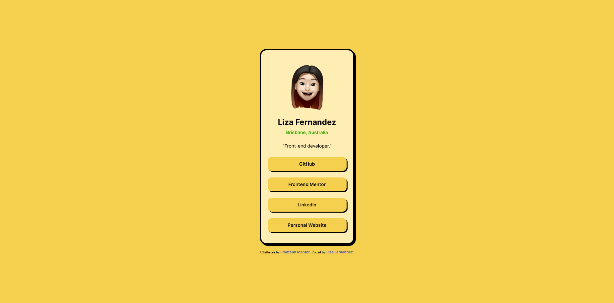
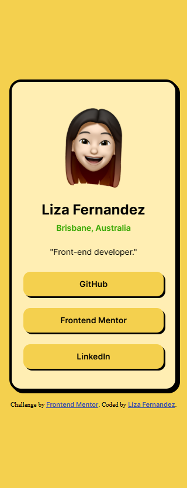

# Frontend Mentor - Social links profile solution

This is a solution to the [Social links profile challenge on Frontend Mentor](https://www.frontendmentor.io/challenges/social-links-profile-UG32l9m6dQ). Frontend Mentor challenges help you improve your coding skills by building realistic projects.

## Table of contents

- [Overview](#overview)
  - [The challenge](#the-challenge)
  - [Screenshot](#screenshot)
  - [Links](#links)
- [My process](#my-process)
  - [Built with](#built-with)
  - [What I learned](#what-i-learned)
  - [Continued development](#continued-development)
  - [Useful resources](#useful-resources)
- [Author](#author)

## Overview

### The challenge

Users should be able to:

- See hover and focus states for all interactive elements on the page

### Screenshot

#### Desktop View



#### Mobile View



### Links

- Solution URL: [https://www.frontendmentor.io/solutions/social-links-profile-challenge-QR72a6bGNV](https://www.frontendmentor.io/solutions/social-links-profile-challenge-QR72a6bGNV)
- Live Site URL: [https://social-links-profile-challenge-0.netlify.app](https://social-links-profile-challenge-0.netlify.app)

## My process

### Built with

- Semantic HTML5 markup
- CSS custom properties
- CSS Grid
- Mobile-first workflow

### What I learned

For this project, I followed the design images provided for the challenge but used a different colour palette. I also added some extra CSS styling to make this project design stand out more. For these features and colour palette, I took inspiration from the 'Blog Preview Post Challenge' I previously completed, that used drop shadows and borders to a card that made it stand out well.

I'm very proud of being able to add my own flare to the design using what I learned from a previous challenge.

Below are the colours used for the design and some code snippets of some CSS codes that I used to make the provided challenge design stand out more.

```css
:root {
  --yellow: hsl(47, 88%, 63%);
  --pale-yellow: hsl(47, 100%, 85%);
  --green: hsl(101, 99%, 33%);
}

.card {
  border: solid;
  border-width: 0.25rem;
  border-radius: 1.25rem;
  filter: drop-shadow(0.25rem 0.25rem #000000);
}
```

Unlike my solutions for previous challenges that had a card as part of the design, I used CSS grids instead of flexbox. I was also able to make the website responsive without the use of media queries. I achieved this through using rem units instead px and choosing the sizes based on the mobile size width of 320px from the start instead of adjusting after completing the desktop size layout.

Overall my major learnings from this challenge, was reinforcing my HTML and CSS knowledge. In particular, I was able to reinforce my knowledge of CSS grids and using a mobile-first workflow.

### Continued development

For future projects and challenges, I would like to continue improving my ability to use CSS grids and a mobile-first workflow. I am also keen to continue attempting to add my own flare to future challenge designs based on my preferences and what I've learned from previous challenges.

### Useful resources

- [CSS Tricks CSS Grid Layout Guide](https://css-tricks.com/snippets/css/complete-guide-grid/) - This guide helped to refresh myself on how to use CSS grids and the syntax used to implement them.

## Author

- Website - [Liza Fernandez](https://www.lizafernandez.dev)
- Frontend Mentor - [@aelvanna](https://www.frontendmentor.io/profile/aelvanna)
